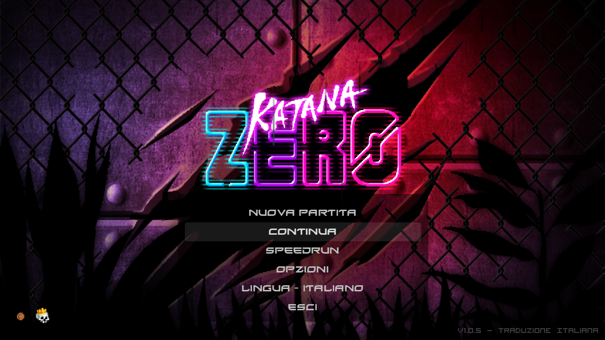
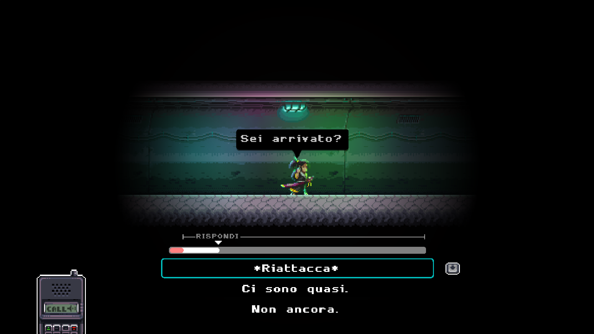

# Katana ZERO - Traduzione Italiana

Sono riuscito con non poche difficoltà a tradurre gli oltre 2000 dialoghi di Katana ZERO in italiano, e scrivere un programma apposito per sostituire il testo.

**ATTENZIONE: Questa patch è stata testata solo sulla versione di gioco "v1.0.5", build "3889288", l'ultima disponibile**

Comunque, dovrebbe funzionare su qualsiasi versione del gioco, ma con la possibilità che alcune linee non vengano tradotte.

 

## Come applicare la traduzione

Il programma per effettuare la patch automaticamente [si trova qui](https://github.com/zWolfrost/Katana-ZERO-Traduzione-Italiana/releases/latest). È necessaria una connessione a internet per poter scaricare le ultime patch (a meno che non si includino queste nella sua stessa cartella).

Inoltre, per sistemi Linux, è **necessario** installare la libreria `libxcb-cursor0` (usando `apt-get` o altri) per poterlo eseguire.

Se il programma dovesse essere segnalato come malware, si consiglia di disabilitare temporaneamente Windows Defender, in quanto si tratta di un falso positivo (molto comune nei file compilati di python). Il codice sorgente completo è disponibile [qui](./patcher/patcher.py).

*Se il programma dovesse dare problemi, per favore segnalali aprendo un'issue, mandandomi un'email o scrivendo sul thread di steam.*

 

## FAQ
### Come posso aiutarti?
Se trovi delle frasi spagnole non tradotte, ti prego di fare uno screenshot e creare un'issue su questa pagina allegando quest'ultimo (o perfino mandare un e-mail andrebbe bene).

Un'altra cosa che potresti fare per aiutarmi sarebbe rendere la traduzione attuale migliore, cioè trovare possibili errori grammaticali, di traduzione o anche semplicemente delle frasi che suonano male nel contesto del gioco, e facendomi sapere.

Inoltre, puoi supportare il mio lavoro donandomi qualcosa [su questa pagina](https://paypal.me/zwolfrost) o [quest'altra](https://buymeacoffee.com/zwolfrost). Ne sarei estremamente grato.

### Non dovrai rifare tutto da capo una volta uscito il DLC?
Fortunatamente le linee tradotte non sono vincolate dalla loro posizione, quindi ci vorrà veramente poco tempo per sistemare le cose. Ovviamente in tal caso dovrò tradurre anche i dialoghi del DLC, e ci vorrà circa una settimana, se sarà lungo quanto il gioco originale.

L'unico problema che potrebbe presentarsi sarebbe se lo sviluppatore dovesse cambiare il modo con cui vengono memorizzate le linee di testo, rendendo il mio programma inutile, e possibilmente rendendo il processo di traduzione molto più lungo e complicato.

### Quanto è fedele questa traduzione?
Ho cercato il più possibile di non distorcere il significato delle frasi, tenendo presente del loro contesto nel gioco, e catturarne l'impatto, ma non assicuro nulla.

### *Hai una domanda non presente tra queste?*
Se hai qualche altra domanda apri un'issue a proposito, chiedila sul thread di steam o mandami un email, e proverò a risponderti in tempo utile.

 

## Screenshots

