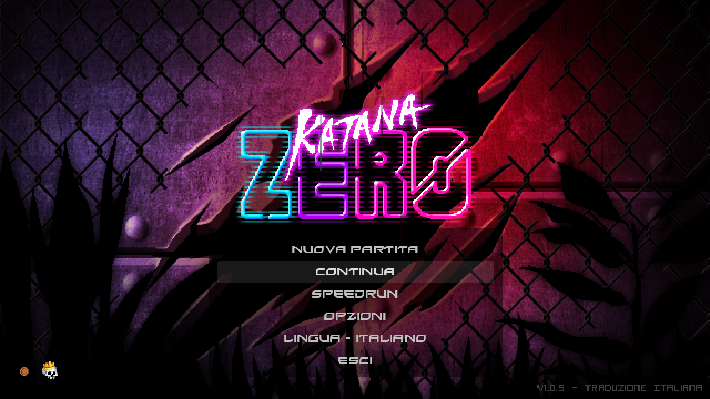
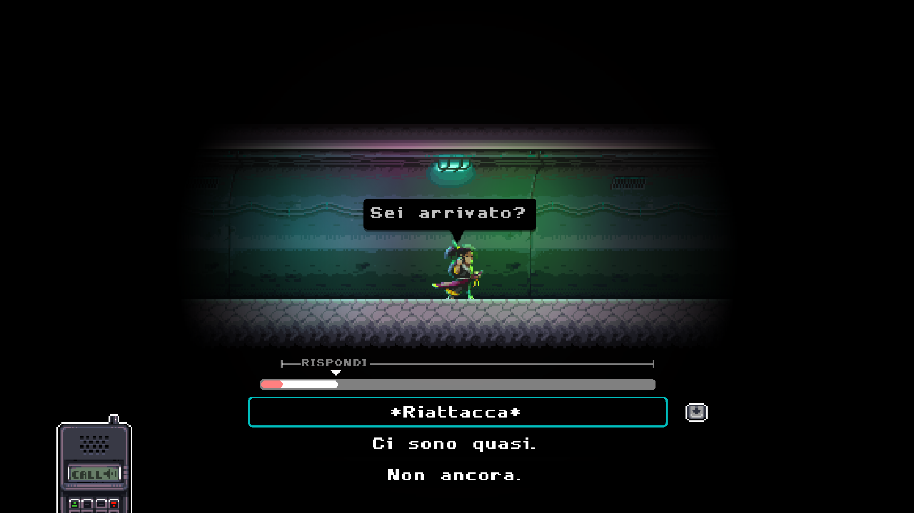

# Katana ZERO - Traduzione Italiana

Sono riuscito con non poche difficoltà a tradurre gli oltre 2000 dialoghi di Katana ZERO in italiano, e scrivere un programma apposito per sostituire il testo.

**ATTENZIONE: Questa patch è stata testata solo sulla versione di gioco "v1.0.5", build "3889288", l'ultima disponibile**

Comunque, dovrebbe funzionare su qualsiasi versione del gioco, ma con la possibilità che alcune linee non vengano tradotte.

 

## Come applicare la traduzione

Il programma per effettuare la patch automaticamente [si trova qui](https://github.com/zWolfrost/Katana-ZERO-Traduzione-Italiana/releases/latest). È necessaria una connessione a internet per lasciare che il programma scarichi le ultime patch (a meno che non si includano queste nella sua stessa cartella).

Inoltre, per sistemi Linux, è in alcuni casi necessario installare la libreria `libxcb-cursor0` (usando il package manager della distribuzione installata) per poterlo eseguire.

Se il programma dovesse essere segnalato come malware, si consiglia di disabilitare temporaneamente Windows Defender, in quanto si tratta di un falso positivo (molto comune nei file compilati di python). Il codice sorgente completo è disponibile [qui](./patcher/patcher.py).

*Se il programma dovesse dare problemi, per favore segnalali aprendo un "issue" su questa pagina o mandandomi un'email.*

 

## FAQ
### Come posso aiutarti?
Se trovi delle frasi spagnole non tradotte, ti prego di fare uno screenshot e allegarlo creando un "issue" su questa pagina (o alternativamente mandandomi un e-mail).

Un'altra cosa che potresti fare per aiutarmi sarebbe trovare possibili errori grammaticali, di traduzione o anche semplicemente delle frasi che suonano male nel contesto del gioco, e farmi sapere con metodi simili.

Inoltre, puoi supportare il mio lavoro donandomi qualcosa [su questa pagina](https://paypal.me/zwolfrost) o [quest'altra](https://buymeacoffee.com/zwolfrost). Ne sarei estremamente grato.

### Quanto è fedele questa traduzione?
Attualmente i testi tradotti sono presi direttamente dalla traduzione italiana ufficiale (presente esclusivamente nella versione da telefono del gioco pubblicata da Netflix, che è stata discontinuata il 14/07/2025), con solo alcune piccole modifiche fatte.

In futuro cercherò il più possibile di non distorcere il significato delle frasi, tenendo presente del loro contesto nel gioco, e catturarne l'impatto, ma non assicuro nulla.

### Non dovrai rifare tutto da capo una volta uscito il DLC?
I testi tradotti non sono vincolati dalla loro posizione, quindi ci vorrà relativamente poco tempo per sistemare le cose. Ovviamente in tal caso dovrò tradurre anche i dialoghi del DLC, e ci vorrà sicuramente un po' di tempo, se sarà lungo quanto il gioco originale.

L'unico problema che potrebbe presentarsi sarebbe se lo sviluppatore dovesse cambiare il modo con cui vengono memorizzati i testi, rendendo il mio programma inutile, e possibilmente rendendo il processo di traduzione molto più lungo e complicato.

### Cosa fa il programma esattamente?
Il programma:
- Crea un backup dei file originali, in modo da poterli ripristinare in qualsiasi momento (premendo il tasto "Rimuovi patch" o manualmente);
- Patcha il file `Katana ZERO.exe` con il file di traduzioni [`kz_exe.txt`](./patches/kz_exe.txt), usando lo strumento [strindex](https://github.com/zWolfrost/strindex) (Qui avviene la sostituzione del testo effettivo);
- Patcha il file `data.win` con uno dei file `datawin_*.xdelta` presenti [qui](./patches), usando lo strumento [xdelta](https://github.com/jmacd/xdelta) (Qui avviene la modifica dei font usati, cambiati in modo da poter supportare i caratteri accentati "í" ed "ó").

### *Hai una domanda non presente tra queste?*
Se hai qualche altra domanda, puoi aprire un "issue" su questa pagina o mandarmi un email, e proverò a risponderti in tempo utile.

 

## Screenshots

